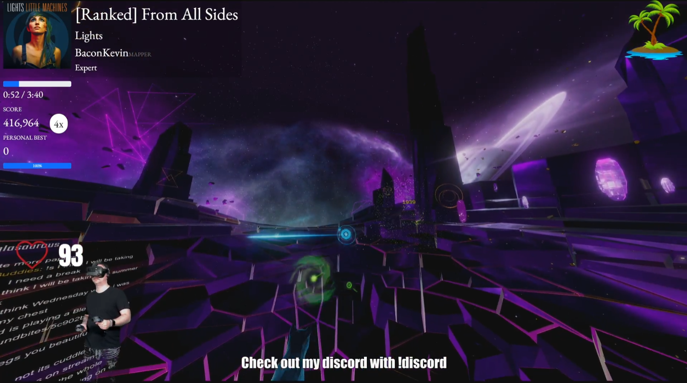

# Rhythm Game Universal Song Overlay



This system provides a browser overlay for OBS that works with a number of VR rhythm games, showing
information on the song being played, album art, song progress, score and player health (where supported).

Currently supported games:

* [Synth Riders](https://synthridersvr.com/)
* [Audica](https://audicagame.com/) 
* [Beat Saber](https://beatsaber.com/)
* [Boombox VR](https://www.boomboxvr.com/)
* [Audio Trip](http://www.kinemotik.com/audiotrip/)

# Usage

## For Single-PC Stream Setups

If you run your stream software (i.e. OBS) on the same computer as your game, you get the
easy setup!  Follow these steps.

1. In OBS, add a new browser source with the following URL:  

```
https://steglasaurous.github.io/universal-song-overlay
```

2. For each game you want to use with the overlay, make sure to check game-specific requirements below.

## For 2-PC Stream Setups

If you run your stream software (i.e. OBS) on a different machine than your game, there's a slightly
different setup you need to follow.  This is to address security issues that prevent the overlay from
connecting to non-secure websocket endpoints (i.e. the games) from a secure website. 

1. Goto the [releases page here](https://github.com/steglasaurous/universal-song-overlay/releases/latest) and download the 
   "universal-song-overlay.zip" file to your **streaming** computer.  
2. Unzip the file anywhere on your PC (e.g. Desktop, Documents, etc). 
3. Open `index.html` in your web browser.  (either double-click or drag it into your web browser)
4. Copy the URL from the web browser's location box at the top (it'll format it the way we need for the OBS browser source).
5. In OBS, add a new browser source and paste the URL into the URL field, then add `#/?websocket_host=1.2.3.4` to the end of the URL, 
   replacing `1.2.3.4` with the IP address of your gaming PC.  Here's an example of what that URL might look like, 
   yours will be slightly different: 

```
file:///C:/Users/subpa/Desktop/universal-song-overlay/index.html#/?websocket_host=10.0.0.29
```

5. For each game you want to use with the overlay, make sure to check game-specific requirements below.

# Game-specific Requirements

## Synth Riders

1. Install the [Synth Riders Websocket mod](https://github.com/KK964/SynthRiders-Websockets-Mod) - this is what publishes game data used by the overlay.

2. Configure Synth's Song Status as per step 1 of [these instructions](https://docs.google.com/document/d/13Ei4bYQRvvhUBIl4Uc5rwls-gvzsQ78bXoJQKQ_qaLo/edit#heading=h.xsyyveoj8zvr). You do not need to do step 2. Note that the important part is making sure that `{{CoverImage}}` is included in the file.  This is what produces the album art for the current song.

**For 2-PC Stream Setups**

By default, the websocket mod is only available to the local machine.  To open it up for remote connections:
1. In your Synth Riders folder, in the `UserData` directory, create a filed called `MelonPreferences.cfg`.  It's possible this file already exists, and that's OK.
2. Add this to the end of the file and save it:

```
[Connection]
Host = "0.0.0.0"
Port = 9000
```

## Audica

1. Install the [Audica Websocket Server mod](https://github.com/steglasaurous/audica-websocket-server) as per its instructions.

## Audio Trip

For a single PC setup, there's no additional setup required - the game has a built-in websocket server to gather
game data from!

For 2-PC setups, you need to configure Audio Trip to run its websocket server externally so your stream PC can connect to it.

1. Download this config file to your computer: [StatServer.cfg](docs/audio-trip/StatServer.cfg)
2. Press Windows+R to open the run dialog, and paste this into it to open your Audio Trip data folder:

```
%USERPROFILE%\AppData\LocalLow\Kinemotik Studios\Audio Trip
```

3. Copy the file you just downloaded into this folder.

## Boombox

No configuration necessary!  Boombox has a built-in websocket server, ready to go!

## Beat Saber

NOTE: Support for Beat Saber is UNTESTED as yet.

Using ModAssistant, make sure that BS Data Puller is installed.    

# Configuration Options

The following options can be passed to the browser overlay by adding a hash and query string at the end of the URL, like this:

```
https://steglasaurous.github.io/universal-song-overlay/#?show=song-details
```

## Customizing look and feel

### Only showing individual components

`show` - a comma-delimited list of parts of the overlay to show.  If not provided, everything is shown by default.   
This is useful to split up parts of the overlay to different parts of the screen instead of everything being together 
in one place. You would do this by creating multiple browser sources in OBS with different URLs.

This list can include any of the following:

* `song-details` - Show details about the song includinig title, artist, mapper, difficulty and album art.
* `song-status` - Show the progress of the song as it plays, with time and a progress bar.
* `score` - Show current score and personal best score (if available)
* `player-health` - Show player's health, if available, with a life bar and percentage.

**Examples**

Show only song details, hide progress, score and health
```
https://steglasaurous.github.io/universal-song-overlay/#?show=song-details
```

Show song details and score, but hide song status and health
```
https://steglasaurous.github.io/universal-song-overlay/#?show=song-details,score
```

Show everything except health
```
https://steglasaurous.github.io/universal-song-overlay/#?show=song-details,song-status,score
```

### Themes and Layout

`theme` - a comma-delimited list of themes to apply.  Some themes are meant to be modifiers to adjust layout.

Currently available themes:

- default - Default white text with a serif font
- sulfur - A purple-inspired theme

More themes coming soon!

Modifiers available:

- align-right - Right-align all items suitable for displaying on the other side of the screen
- stretch-health-progress-bar - Instead of constraining the health progress bar, it's allowed to fill the width of the screen.
- stretch-song-progress-bar - Instead of constraining the song progress bar, it's allowed to fill the width of the screen.

The stretch modifiers are useful when you want do things like showing the progress bar at the bottom of the screen at full size.

**Examples**

Use the sulfur theme:

```
https://steglasaurous.github.io/universal-song-overlay/#?theme=sulfur
```

Use the sulfur theme but right-align all the content:

```
https://steglasaurous.github.io/universal-song-overlay/#?theme=sulfur,align-right
```

Stretch the song status bar to fill the width of the screen, and only show the song status bar:

```
https://steglasaurous.github.io/universal-song-overlay/#?theme=sulfur,stretch-song-progress-bar&show=song-status
```

## Websocket

`websocket_host` - The IP address or host name of the websocket server(s).  Useful for 2-pc stream setups where
the websocket server(s) may be running on a different machine.  Default is localhost. **NOTE** This will ONLY work
with the 2-PC setup option above.

# For Developers: How to build

If you want to add/modify things in this overlay, here's how to build it.

You'll need Node.js v16 or higher installed.

For initial setup, run:

```
npm install
```

To start a development server: `npx ng serve`.  This will start a webserver at http://localhost:4200

To build a production-ready release: `npm run build`.  This will place the build output in dist.  Note that a postbuild script
runs after the build finishes to copy the script contents into the html itself to support running without a webserver.

## Creating themes

Themes are SCSS files that live in `src/themes`.  

To create your own theme: 

* Create your own SCSS file and place it in the `src/themes` folder. (if it's a modifier - i.e. a change that can apply to all themes, place it in `src/themes/modifiers`)
* In `angular.json`, add your theme to the styles list, located under `projects > universal-song-overlay > architect > build > options > styles` like this:

```json
"styles": [
  "src/styles.scss",
  {
    "input": "src/themes/default.scss",
    "bundleName": "default",
    "inject": false
  },
  // Your new theme:
  {
    "input": "src/themes/your-new-theme.scss",
    "bundleName": "your-new-theme",
    "inject": false
  }
]
```

Your theme will be accessible via the theme parameter with the name you gave for `bundleName` above.

See `src/themes/default.scss` for a rundown of available classes you can override.
